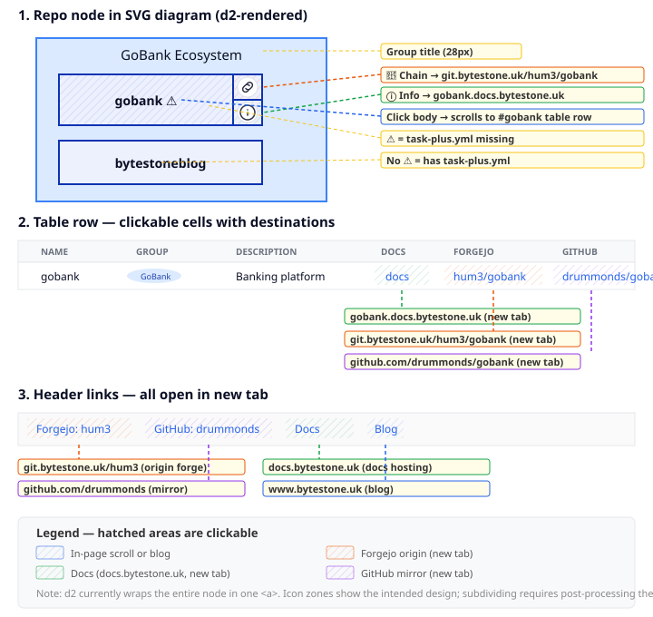

# Repo Symbol Design

The dashboard diagram uses [d2](https://d2lang.com) to render repository nodes inside group containers. The page below the diagram has a table with links to docs, origin and mirror forges.

## Annotated Breakdown

## Repo Node (SVG diagram)

Each repository is a d2 rectangle with:

- **Fill**: `#EDF0FD` (light blue, from d2 theme `fill-B5`)
- **Border**: `#0D32B2` (blue, 2px, from d2 theme `stroke-B1`)
- **Label**: bold 16px, centred, dark `#0A0F25`
- **`link`**: anchor `#repo-name` — clicking the node scrolls to the table row
- **`tooltip`**: one-line description, rendered as `<title>` for hover

### d2 Appendix Icons

d2 automatically adds two 32x32 circle icons to the bottom-right of each node:

- **Chain icon** — intended to link to the origin forge (`codeberg.org/hum3/<name>`)
- **Info icon** — intended to link to the docs page (`h3-<name>.statichost.page`)

Currently d2 wraps the entire node in a single `<a>` (scrolling to the table row). To make each icon an independent click target the node rectangle must be subdivided in the SVG — this requires post-processing the d2 output.

### Warning Indicator

Nodes with `⚠️` in the label indicate the repo does not yet have a `task-plus.yml` configuration. Nodes without it are fully configured.

## Clickable Areas

All clickable areas are shown with diagonal hatching in the annotated diagram, colour-coded by destination.

### Diagram node zones

| Zone | Hatch | Destination |
|---|---|---|
| Body (rectangle) | blue | Scrolls to `#<name>` table row (in-page) |
| Chain icon | orange | Origin forge: `codeberg.org/hum3/<name>` (new tab) |
| Info icon | green | Docs: `h3-<name>.statichost.page` (new tab) |

### Table row links

| Column | Hatch | Destination |
|---|---|---|
| Docs | green | `https://h3-<name>.statichost.page/` (new tab) |
| Codeberg | orange | `https://codeberg.org/hum3/<name>` (new tab) |
| GitHub | purple | `https://github.com/drummonds/<name>` (new tab) |

### Header links
The page header links to the forge organisations, StaticHost admin, and blog. All external links (`https://`) open in a new tab via a `target="_blank"` script.

## Group Container

Repos are grouped into ecosystem containers:

| Group | Fill | Stroke |
|---|---|---|
| GoBank | `#dbeafe` | `#3b82f6` |
| Parsing | `#ffedd5` | `#f97316` |
| Godocs | `#dcfce7` | `#22c55e` |
| Web & UI | `#f3e8ff` | `#a855f7` |
| Hardware | `#fce7f3` | `#ec4899` |
| Data | `#fef9c3` | `#eab308` |
| Tooling | `#f1f5f9` | `#64748b` |
| Libraries | `#e0f2fe` | `#0ea5e9` |
| GitHub Only | `#fee2e2` | `#ef4444` |

Each container uses `grid-columns: 2` for layout.

## Relationships

Dashed arrows between groups show cross-ecosystem dependencies (e.g. GoBank uses Parsing, Godocs uses Hardware thumbnails).

## Source

The diagram is defined in `dashboard.d2` and rendered to `docs/dashboard.svg` via `task docs:build`.

After d2 renders the SVG, `cmd/svgpost` post-processes it to wrap each appendix icon in an `<a>` tag:

- **Info icon** → links to the repo's docs page (`h3-<name>.statichost.page`)
- **Chain icon** → links to the origin forge (Codeberg), falling back to GitHub for GitHub-only repos

URLs are extracted from the table in `index.html`, so the SVG links stay in sync with the table automatically.
